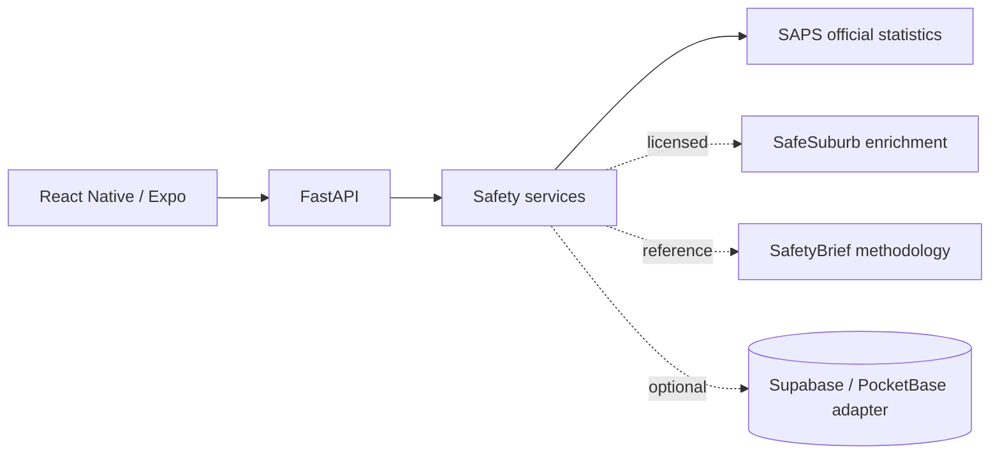

# Backend Architecture

The backend runs on Python 3.12 with FastAPI and Uvicorn. It is the single public API consumed by the Travel Safe Expo client. Persistence and external data providers stay behind FastAPI so the frontend does not depend on vendor-specific record shapes.

## API contract

Update this table first whenever an endpoint changes so the frontend team has a reliable contract.

| Endpoint | Method | Request shape | Response shape |
|---|---|---|---|
| `/health` | GET | None | `{ "status": "ok" }` |
| `/api/v1/sources` | GET | None | Source list with governance status, role and URL |
| `/api/v1/stats` | GET | `area_code` | Precinct-level reported-crime statistics + caveats |
| `/api/v1/heatmap` | GET | `bbox=west,south,east,north&zoom=5..18` | Aggregate map cells; never fabricated incident pins |
| `/api/v1/areas/{area_code}/safety` | GET | Path area code | Confidence-aware signal; may return `insufficient_data` |

## MVP data behavior

The first review branch contains one deterministic Woodstock reference fixture so frontend work can integrate against a realistic response shape.

- Period: Apr 2025–Mar 2026.
- Total reported crimes: 3,541.
- Latest quarter Apr–Jun 2026: 910 vs 800 in Apr–Jun 2025.
- Data resolution remains whole police precinct.
- The fixture is not a live SafeSuburb feed and must not be represented as one.
- Heat-map centroids are area context only, not crime-event coordinates.
- The API intentionally withholds a safety score until peer calibration, denominator quality and model validation are agreed.

See [safety-data-sources.md](safety-data-sources.md) for source governance.
