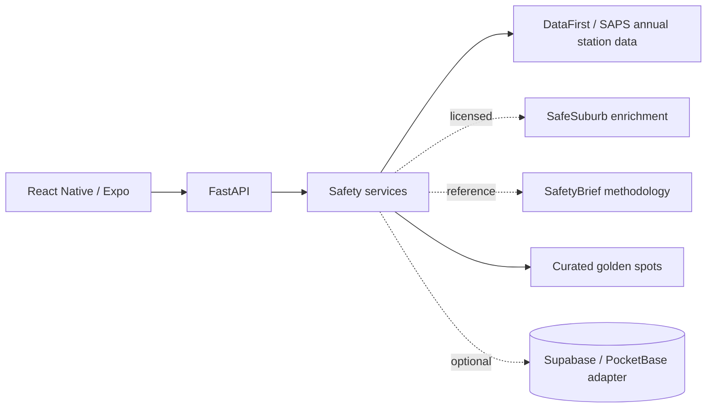

# Backend Architecture

The backend runs on Python 3.12 with FastAPI and Uvicorn. It is the single public API consumed by the Travel Safe Expo client. Persistence and external data providers stay behind FastAPI so the frontend does not depend on vendor-specific record shapes.

## API contract

Update this table first whenever an endpoint changes so the frontend team has a reliable contract.

| Endpoint | Method | Request shape | Response shape |
|---|---|---|---|
| `/health` | GET | None | `{ "status": "ok" }` |
| `/api/v1/sources` | GET | None | Source list with governance status |
| `/api/v1/dataset/status` | GET | None | DataFirst load/coverage state |
| `/api/v1/stats` | GET | `area_code`, optional `year` | Station annual statistics |
| `/api/v1/heatmap` | GET | `bbox`, `zoom`, optional `year`, `limit` | National station heat anchors |
| `/api/v1/map/search` | GET | `q`, optional `year`, `limit` | Station + golden-spot search |
| `/api/v1/golden-spots` | GET | `bbox`, optional `q` | Curated gold map markers |
| `/api/v1/areas/{area_code}/safety` | GET | optional `year` | Safety + danger signal |

## National heat-map contract

When the DataFirst CSV is loaded, every mappable police-station/year row can produce a heat-map anchor with:

- station, municipality and district;
- annual `danger_score` (0-100);
- inverse `safety_score` (100-danger score);
- `risk_band`: `green`, `orange` or `red`;
- frontend-ready `color`;
- top reported crime categories;
- confidence and quality flags;
- explicit station-aggregate resolution.

Map colours are contract values:

- Green `#22C55E`: danger score `< 45`;
- Orange `#F97316`: `45 <= score < 75`;
- Red `#EF4444`: `score >= 75`;
- Gold `#D4AF37`: curated local-known spot, not a safety grade.

See [danger-scoring.md](danger-scoring.md) for the algorithm and [safety-data-sources.md](safety-data-sources.md) for source governance.
