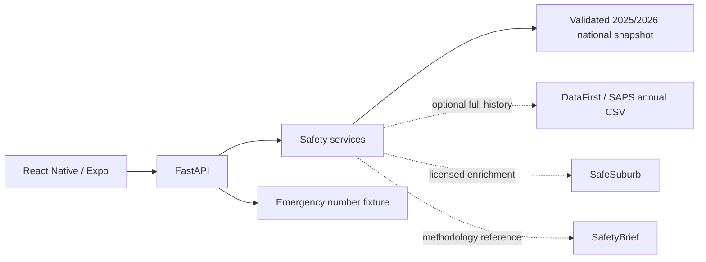

# Backend Architecture

The backend runs on Python 3.12 with FastAPI and Uvicorn. It is the single
public API consumed by the Travel Safe Expo client. External data sources and
optional persistence stay behind FastAPI.

## API contract

Update this table first whenever an endpoint changes so the frontend team has
a reliable contract.

| Endpoint | Method | Request shape | Response shape |
|---|---|---|---|
| `/health` | GET | None | `{ "status": "ok" }` |
| `/api/v1/sources` | GET | None | Source list with governance status |
| `/api/v1/dataset/status` | GET | None | Active national data mode/coverage |
| `/api/v1/stats` | GET | `area_code`, optional `year` | Station annual statistics |
| `/api/v1/heatmap` | GET | `bbox`, `zoom`, optional `year`, `limit` | National station safety anchors |
| `/api/v1/map/search` | GET | `q`, optional `year`, `limit` | Internal police-station search |
| `/api/v1/areas/{area_code}/safety` | GET | optional `year` | Safety + danger signal |
| `/api/v1/emergency-numbers` | GET | optional `service_type` | Verified emergency picker numbers + source attribution |

## Active national data priority

1. A configured full DataFirst v1.4 CSV is used only when it validates the
   official signature: 24,206 records, latest year 2025/2026, 1,174 stations.
2. Otherwise the backend uses the checked-in validated 2025/2026 derived
   snapshot containing 1,128 mappable stations.
3. If neither national source is available, only the limited reference fixture
   is available.

The public `dataset/status` response exposes only the filename/data mode, not
an absolute server filesystem path.

## National heat-map contract

Each mappable station record can expose:

- station, municipality and district;
- `danger_score` from 0-100;
- inverse `safety_score`;
- `risk_band`: green, orange or red;
- frontend-ready colour;
- common crime categories;
- confidence and quality flags;
- explicit annual police-station aggregate resolution.

Map colours:

- Green `#22C55E`: danger score < 45;
- Orange `#F97316`: 45 <= danger score < 75;
- Red `#EF4444`: danger score >= 75.

Halo is a separate community-place overlay and API. Halo ratings never alter
these safety scores.

See [danger-scoring.md](danger-scoring.md),
[safety-data-sources.md](safety-data-sources.md), and
[emergency-numbers.md](emergency-numbers.md).
