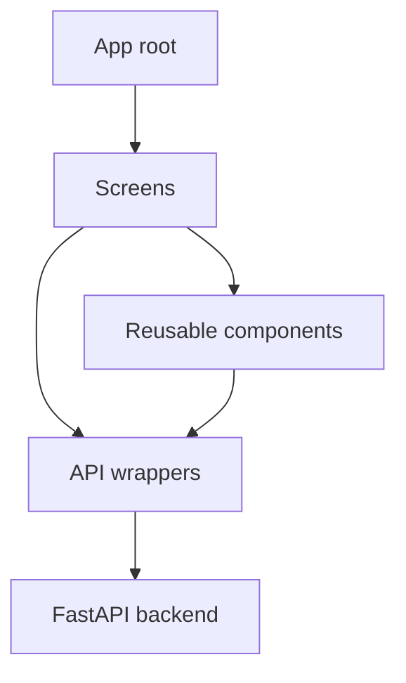

# Frontend Architecture

The mobile app uses Expo, React Native, and TypeScript. Screens compose reusable components and call typed API wrappers for backend communication.

Keep API wrappers aligned with the canonical contract in [`backend/docs/architecture.md`](../../backend/docs/architecture.md). Do not duplicate the contract here; update the backend contract first whenever an endpoint changes.
