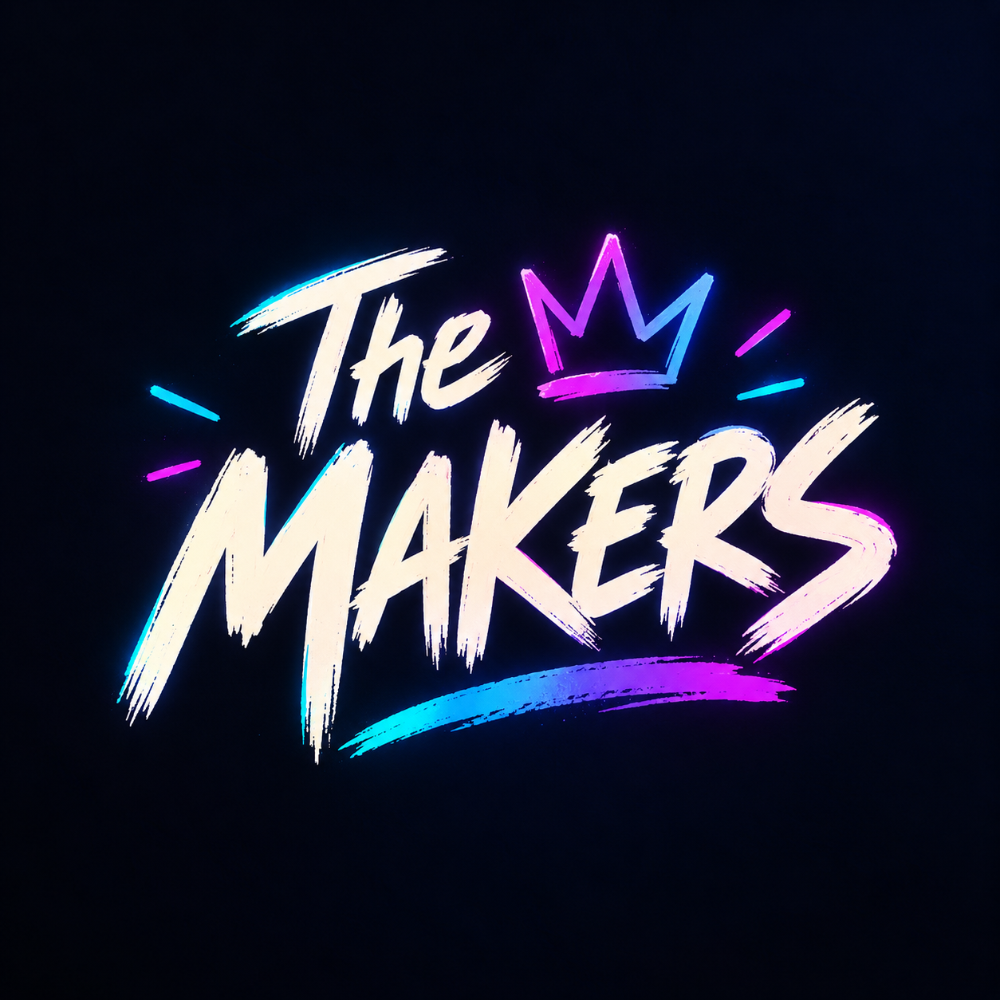

  

<h1 align="center">THE MAKERS — Team Kit</h1>

<em>Builders Table 2026 · 24-Hour Build Sprint · 18–19 September 2026</em>

<em>Parkview, Woodstock, Cape Town</em>

---

## 01. Quick Links

- **Event page:** [https://builderstable.net/](https://builderstable.net/)
- **Team page / dashboard:** *[ add once available ]*
- **GitHub repo:** [https://github.com/MargaretThomas/travel-safe](https://github.com/MargaretThomas/travel-safe)
- **Figma file:** *[ add if/when we start one ]*
- **WhatsApp group:** *[ add invite link ]*

---

## 02. Event Details

- **Dates:** 18–19 September 2026 (both days)
- **Venue:** Parkview, Woodstock, Cape Town
- **Tickets:** Complimentary for the team — already confirmed, no payment required.
- **Format:** 24-hour build sprint. The brief is revealed live at 09:00 on Friday — nothing is known or prepped in advance.
- **Prize:** R50,000 winner-takes-all, plus sponsor tool credits and a founders' session for the top 5 finalist teams.

**Key rules**
- No pre-built project work — general tools, tech stacks and component libraries are fine, but nothing built specifically for the challenge. Repos are reviewed at submission.
- Teams keep full IP on whatever is built — no licence back to organisers or sponsors.
- Wi-Fi is provided throughout.

---

## 03. Timeline

**Day 1 — Friday 18 September (Build direction)**

| Time | Item |
|---|---|
| 08:00 | Registration & Check-in |
| 08:45 | Welcome & Opening |
| 09:00 | Challenge Brief |
| 10:00 | Build Sprint 1 |
| 12:00 | Lunch |
| 12:30 | Build Sprint 2 |
| 15:00 | Break |
| 15:15 | Build Sprint 3 |
| 16:45 | Day 1 Checkpoint & Submission |
| 17:00 | Networking & Dinner |
| 18:00 | Evening Build Sprint (optional) |

**Day 2 — Saturday 19 September (Refine & submit)**

| Time | Item |
|---|---|
| 08:30 | Doors Open |
| 09:00 | Welcome Back & Final Brief |
| 09:30 | Build Sprint 4 |
| 11:30 | Submission Window (closes 11:59) |
| 12:00 | Lunch |
| 13:00 | Finalist presentations & awards |
| 16:30 | Cocktail Hour |
| 18:00 | Afterparty |

---

## 04. Roles & Responsibilities

Fixed roles can be assigned now. Build roles (frontend/backend/etc.) may shift once we see the brief on Friday — overlap is fine, we're only 3–5 people.

| Role | Assigned To | Overlap / Backup |
|---|---|---|
| Team Lead & Logistics | Margaret | N/A |
| Repo / Git Owner | Margaret | N/A |
| Frontend lead | Sibongiseni | Margaret - additional dev |
| Backend lead | Lathithaa | Zoe - additional dev |
| Pitch Lead (5-min demo) | Zoe | Lathithaa |

---
